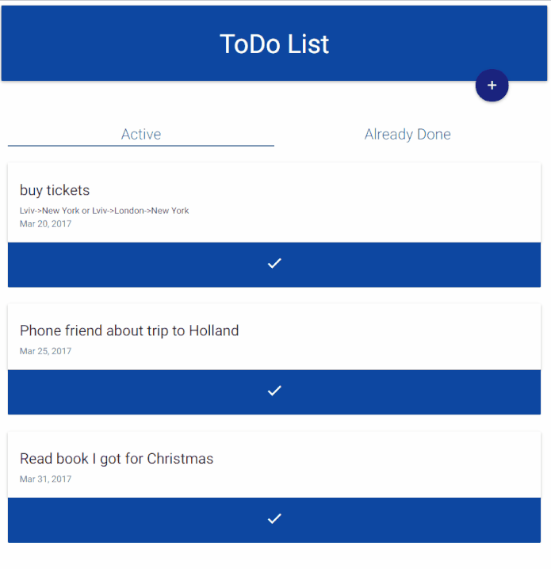

# To Do List (MEAN Stack)
A simple ToDo Material design Angular 2 App

## Installation
### Backend
Install express for the server, and the component dependencie

    $ npm install 
### Frontend
 Install Angular 2 component dependencies:
 
    $ npm install 
## Running  app
1. Set up MongoDb database and in backend/rest.js replace connection string
2. Build frontend (ng build --prod --aot --output-path ./backend/public) into backend/public folder
3. From backend folder run node index.js and navigate to http://localhost:4400/ 

## Components used
- MEAN Stack
  - [MongoDB](https://www.mongodb.com/)  as database 
  - [Express](http://expressjs.com/)  as backend framework 
  - [Angular 2](https://angular.io/)  for frontend app
  - [node.js](https://nodejs.org/en/)  for backend
 - [Materialize](http://materializecss.com/) for material css style
 
## License

  MIT